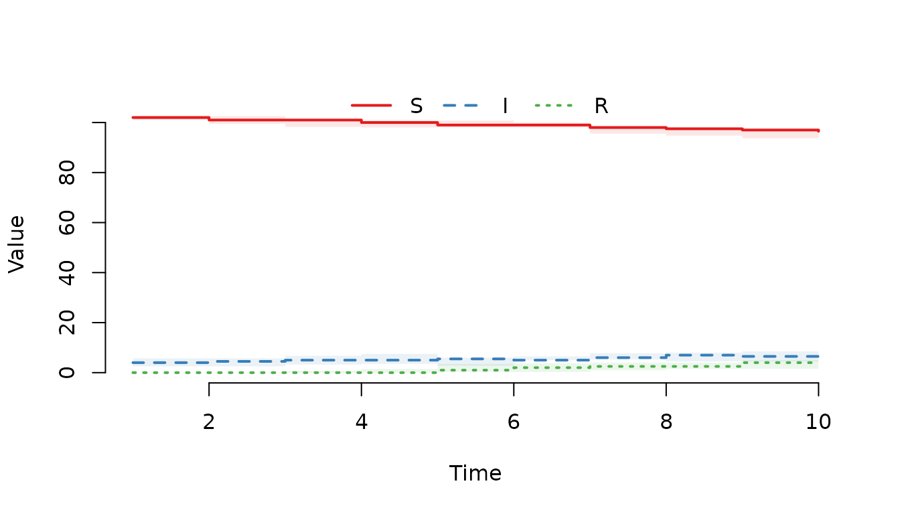
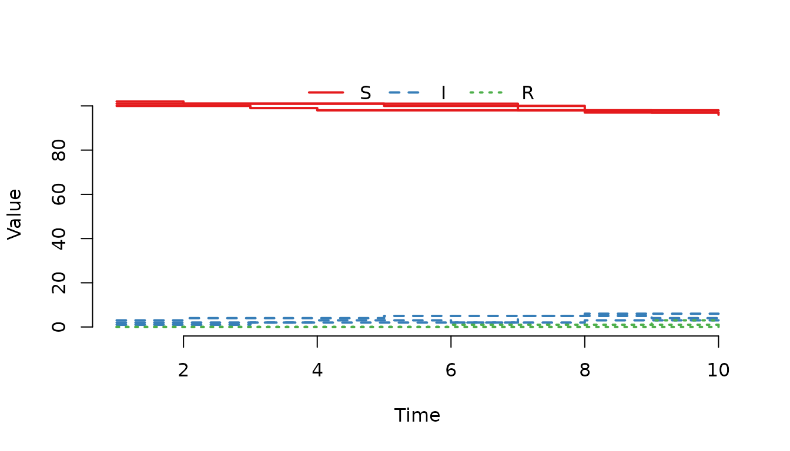

# Post-process data in a trajectory

After a model is created, a simulation is started with a call to the
[`run()`](http://stewid.github.io/SimInf/reference/run.md) function with
the model as the first argument. The function returns a modified model
object with a single stochastic solution trajectory attached to it.
Trajectory data contains the state of each compartment, recorded at
every time-point in `tspan`. This document introduces you to
functionality in `SimInf` to post-process and explore that trajectory
data.

## Extract trajectory data with `trajectory()`

Most modelling and simulation studies require custom data analysis once
the simulation data has been generated. To support this, SimInf provides
the
[`trajectory()`](http://stewid.github.io/SimInf/reference/trajectory.md)
method to obtain a `data.frame` with the number of individuals in each
compartment at the time points specified in `tspan`.

Let’s simulate 10 days of data from an SIR model with 6 nodes. For
reproducibility, we first call the
[`set.seed()`](https://rdrr.io/r/base/Random.html) function and specify
the number of threads to use for the simulation.

``` r
library(SimInf)

set.seed(123)
set_num_threads(1)

u0 <- data.frame(S = c(100, 101, 102, 103, 104, 105),
                 I = c(1, 2, 3, 4, 5, 6),
                 R = c(0, 0, 0, 0, 0, 0))

model  <- SIR(u0 = u0,
              tspan = 1:10,
              beta = 0.16,
              gamma = 0.077)

result <- run(model)
```

Extract the number of individuals in each compartment at the time-points
in `tspan`.

``` r
trajectory(result)
```

    ##    node time   S  I R
    ## 1     1    1 100  1 0
    ## 2     2    1 101  2 0
    ## 3     3    1 102  3 0
    ## 4     4    1 102  5 0
    ## 5     5    1 103  6 0
    ## 6     6    1 105  6 0
    ## 7     1    2 100  1 0
    ## 8     2    2 101  2 0
    ## 9     3    2 101  4 0
    ## 10    4    2 101  5 1
    ## 11    5    2 103  6 0
    ## 12    6    2 105  6 0
    ## 13    1    3  99  2 0
    ## 14    2    3 101  2 0
    ## 15    3    3 101  4 0
    ## 16    4    3  99  6 2
    ## 17    5    3 101  8 0
    ## 18    6    3 103  7 1
    ## 19    1    4  98  3 0
    ## 20    2    4 101  2 0
    ## 21    3    4 101  4 0
    ## 22    4    4  98  6 3
    ## 23    5    4  99 10 0
    ## 24    6    4 101  8 2
    ## 25    1    5  98  3 0
    ## 26    2    5 101  2 0
    ## 27    3    5 100  5 0
    ## 28    4    5  97  6 4
    ## 29    5    5  98  9 2
    ## 30    6    5 101  6 4
    ## 31    1    6  98  2 1
    ## 32    2    6 101  2 0
    ## 33    3    6 100  5 0
    ## 34    4    6  97  5 5
    ## 35    5    6  98  8 3
    ## 36    6    6 100  7 4
    ## 37    1    7  98  2 1
    ## 38    2    7  98  5 0
    ## 39    3    7 100  5 0
    ## 40    4    7  92 10 5
    ## 41    5    7  98  7 4
    ## 42    6    7  99  8 4
    ## 43    1    8  97  3 1
    ## 44    2    8  98  5 0
    ## 45    3    8  98  6 1
    ## 46    4    8  92  8 7
    ## 47    5    8  95 10 4
    ## 48    6    8  99  8 4
    ## 49    1    9  97  3 1
    ## 50    2    9  97  6 0
    ## 51    3    9  98  4 3
    ## 52    4    9  91  9 7
    ## 53    5    9  94 10 5
    ## 54    6    9  99  7 5
    ## 55    1   10  97  3 1
    ## 56    2   10  96  6 1
    ## 57    3   10  98  4 3
    ## 58    4   10  89 11 7
    ## 59    5   10  93  9 7
    ## 60    6   10  98  8 5

Extract the number of recovered individuals in the first node.

``` r
trajectory(result, compartments = "R", index = 1)
```

    ##    node time R
    ## 1     1    1 0
    ## 2     1    2 0
    ## 3     1    3 0
    ## 4     1    4 0
    ## 5     1    5 0
    ## 6     1    6 1
    ## 7     1    7 1
    ## 8     1    8 1
    ## 9     1    9 1
    ## 10    1   10 1

Extract the number of recovered individuals in the first and third node.

``` r
trajectory(result, compartments = "R", index = c(1, 3))
```

    ##    node time R
    ## 1     1    1 0
    ## 2     3    1 0
    ## 3     1    2 0
    ## 4     3    2 0
    ## 5     1    3 0
    ## 6     3    3 0
    ## 7     1    4 0
    ## 8     3    4 0
    ## 9     1    5 0
    ## 10    3    5 0
    ## 11    1    6 1
    ## 12    3    6 0
    ## 13    1    7 1
    ## 14    3    7 0
    ## 15    1    8 1
    ## 16    3    8 1
    ## 17    1    9 1
    ## 18    3    9 3
    ## 19    1   10 1
    ## 20    3   10 3

Consult the help page for other
[`trajectory()`](http://stewid.github.io/SimInf/reference/trajectory.md)
parameter options.

## Calculate prevalence from a trajectory using `prevalence()`

Use the `prevalence` function to calculate the proportion of individuals
with disease in the population. The
[`prevalence()`](http://stewid.github.io/SimInf/reference/prevalence.md)
function takes a model object and a formula specification, where the
left-hand-side of the formula specifies the compartments representing
cases i.e. have an attribute or a disease. The right-hand-side of the
formula specifies the compartments at risk.

Let’s use the previously simulated data and determine the proportion of
infected individuals in the population at the time-points in `tspan`.

``` r
prevalence(result, I ~ S + I + R)
```

    ##    time prevalence
    ## 1     1 0.03616352
    ## 2     2 0.03773585
    ## 3     3 0.04559748
    ## 4     4 0.05188679
    ## 5     5 0.04874214
    ## 6     6 0.04559748
    ## 7     7 0.05817610
    ## 8     8 0.06289308
    ## 9     9 0.06132075
    ## 10   10 0.06446541

Identical result is obtained with the shorthand ‘I ~ .’

``` r
prevalence(result, I ~ .)
```

    ##    time prevalence
    ## 1     1 0.03616352
    ## 2     2 0.03773585
    ## 3     3 0.04559748
    ## 4     4 0.05188679
    ## 5     5 0.04874214
    ## 6     6 0.04559748
    ## 7     7 0.05817610
    ## 8     8 0.06289308
    ## 9     9 0.06132075
    ## 10   10 0.06446541

The prevalence function has an argument `level` which has a default
`level = 1`. This returns the prevalence at the whole population level.
Since we have several nodes (farms if you like) in the model now, we can
also ask for the proportion of nodes with infected individuals by
specifying `level = 2`.

``` r
prevalence(result, I ~ S + I + R, level = 2)
```

    ##    time prevalence
    ## 1     1          1
    ## 2     2          1
    ## 3     3          1
    ## 4     4          1
    ## 5     5          1
    ## 6     6          1
    ## 7     7          1
    ## 8     8          1
    ## 9     9          1
    ## 10   10          1

Finally, we may wish to know the proportion of infected individuals
within each node with `level = 3`.

``` r
prevalence(result, I ~ S + I + R, level = 3)
```

    ##    node time prevalence
    ## 1     1    1 0.00990099
    ## 2     2    1 0.01941748
    ## 3     3    1 0.02857143
    ## 4     4    1 0.04672897
    ## 5     5    1 0.05504587
    ## 6     6    1 0.05405405
    ## 7     1    2 0.00990099
    ## 8     2    2 0.01941748
    ## 9     3    2 0.03809524
    ## 10    4    2 0.04672897
    ## 11    5    2 0.05504587
    ## 12    6    2 0.05405405
    ## 13    1    3 0.01980198
    ## 14    2    3 0.01941748
    ## 15    3    3 0.03809524
    ## 16    4    3 0.05607477
    ## 17    5    3 0.07339450
    ## 18    6    3 0.06306306
    ## 19    1    4 0.02970297
    ## 20    2    4 0.01941748
    ## 21    3    4 0.03809524
    ## 22    4    4 0.05607477
    ## 23    5    4 0.09174312
    ## 24    6    4 0.07207207
    ## 25    1    5 0.02970297
    ## 26    2    5 0.01941748
    ## 27    3    5 0.04761905
    ## 28    4    5 0.05607477
    ## 29    5    5 0.08256881
    ## 30    6    5 0.05405405
    ## 31    1    6 0.01980198
    ## 32    2    6 0.01941748
    ## 33    3    6 0.04761905
    ## 34    4    6 0.04672897
    ## 35    5    6 0.07339450
    ## 36    6    6 0.06306306
    ## 37    1    7 0.01980198
    ## 38    2    7 0.04854369
    ## 39    3    7 0.04761905
    ## 40    4    7 0.09345794
    ## 41    5    7 0.06422018
    ## 42    6    7 0.07207207
    ## 43    1    8 0.02970297
    ## 44    2    8 0.04854369
    ## 45    3    8 0.05714286
    ## 46    4    8 0.07476636
    ## 47    5    8 0.09174312
    ## 48    6    8 0.07207207
    ## 49    1    9 0.02970297
    ## 50    2    9 0.05825243
    ## 51    3    9 0.03809524
    ## 52    4    9 0.08411215
    ## 53    5    9 0.09174312
    ## 54    6    9 0.06306306
    ## 55    1   10 0.02970297
    ## 56    2   10 0.05825243
    ## 57    3   10 0.03809524
    ## 58    4   10 0.10280374
    ## 59    5   10 0.08256881
    ## 60    6   10 0.07207207

Consult the help page for other
[`prevalence()`](http://stewid.github.io/SimInf/reference/prevalence.md)
parameter options.

## Visualize a trajectory with `plot()`

The [`plot()`](https://rdrr.io/r/graphics/plot.default.html) function is
another useful way of inspecting the outcome of a trajectory. It can
display either the median and the quantile range of the counts in all
nodes, plot the counts in specified nodes, or the prevalence. Below are
some examples of using the
[`plot()`](https://rdrr.io/r/graphics/plot.default.html) function.

Plot the median and interquartile range of the number of susceptible,
infected and recovered individuals.

``` r
plot(result)
```



Plot the median and the middle 95% quantile range of the number of
susceptible, infected and recovered individuals.

``` r
plot(result, range = 0.95)
```


Plot the median and interquartile range of the number of infected
individuals.

``` r
plot(result, "I")
```


Use the formula notation instead to plot the median and interquartile
range of the number of infected individuals.

``` r
plot(result, ~I)
```


Plot the number of susceptible, infected and recovered individuals in
the first three nodes.

``` r
plot(result, index = 1:3, range = FALSE)
```



Use plot type line instead.

``` r
plot(result, index = 1:3, range = FALSE, type = "l")
```


Plot the number of infected individuals in the first node.

``` r
plot(result, "I", index = 1, range = FALSE)
```


Plot the proportion of infected individuals (cases) in the population.

``` r
plot(result, I ~ S + I + R)
```


Plot the proportion of nodes with infected individuals.

``` r
plot(result, I ~ S + I + R, level = 2)
```


Plot the median and interquartile range of the proportion of infected
individuals in each node

``` r
plot(result, I ~ S + I + R, level = 3)
```


Plot the proportion of infected individuals in the first three nodes.

``` r
plot(result, I ~ S + I + R, level = 3, index = 1:3, range = FALSE)
```


Please run a couple of `plot(run(model))` to view the stochasticity
between trajectories. To find help on the SimInf plot function for the
model object run:

``` r
help("plot,SimInf_model-method", package = "SimInf")
```
