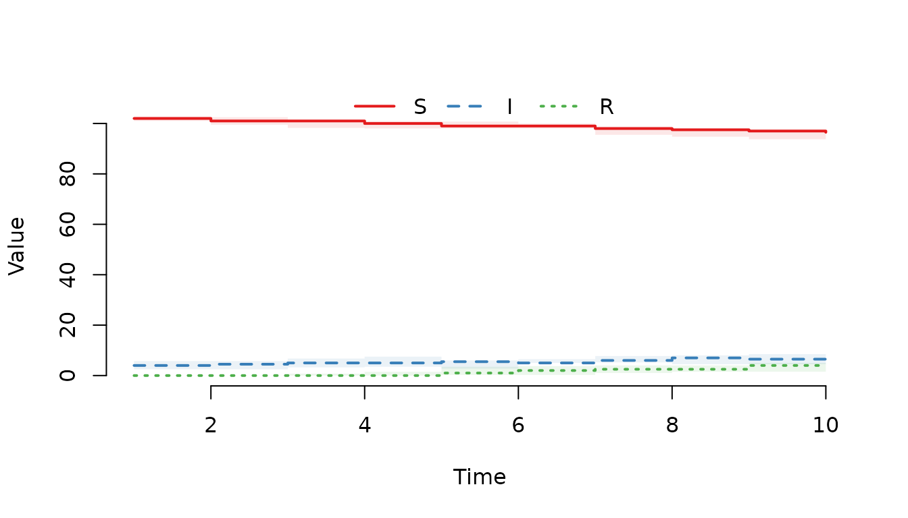
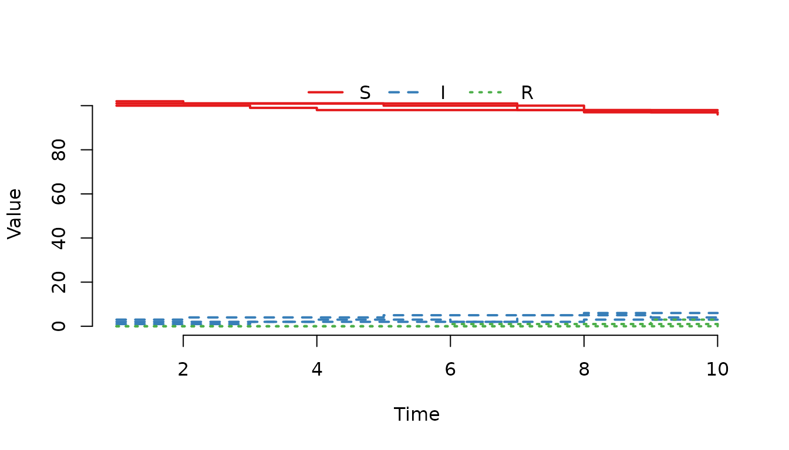
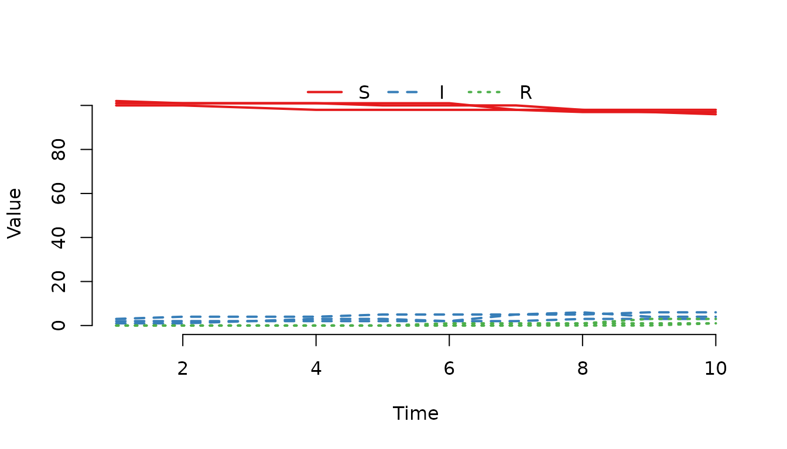

# Post-process data in a trajectory

After a model is created, a simulation is started with a call to the
[`run()`](http://stewid.github.io/SimInf/reference/run.md) function. The
function returns a modified model object containing a single stochastic
solution trajectory. This trajectory includes the state of each
compartment recorded at every time-point specified in `tspan`.

This vignette introduces the functionality in `SimInf` to post-process
and explore this trajectory data.

Let us first load the SimInf package.

``` r
library(SimInf)
```

## Extract trajectory data with `trajectory()`

Most modeling studies require custom data analysis beyond simple
plotting. To support this, `SimInf` provides the
[`trajectory()`](http://stewid.github.io/SimInf/reference/trajectory.md)
method to extract the raw data as a `data.frame`. This is useful if you
need to:

- Perform custom statistical calculations (e.g., time to peak).
- Export data to CSV for use in other software.
- Combine results from multiple simulation runs.

Let’s simulate 10 days of data from an SIR model with 6 nodes. For
reproducibility, we set the seed and specify the number of threads.

``` r
set.seed(123)
set_num_threads(1)

u0 <- data.frame(
  S = c(100, 101, 102, 103, 104, 105),
  I = c(1, 2, 3, 4, 5, 6),
  R = c(0, 0, 0, 0, 0, 0)
)

model  <- SIR(
  u0 = u0,
  tspan = 1:10,
  beta = 0.16,
  gamma = 0.077
)

result <- run(model)
```

Extract the full trajectory data (all compartments, all nodes).

``` r
trajectory(result)
```

    ##    node time   S  I R
    ## 1     1    1 100  1 0
    ## 2     2    1 101  2 0
    ## 3     3    1 102  3 0
    ## 4     4    1 102  5 0
    ## 5     5    1 103  6 0
    ## 6     6    1 105  6 0
    ## 7     1    2 100  1 0
    ## 8     2    2 101  2 0
    ## 9     3    2 101  4 0
    ## 10    4    2 101  5 1
    ## 11    5    2 103  6 0
    ## 12    6    2 105  6 0
    ## 13    1    3  99  2 0
    ## 14    2    3 101  2 0
    ## 15    3    3 101  4 0
    ## 16    4    3  99  6 2
    ## 17    5    3 101  8 0
    ## 18    6    3 103  7 1
    ## 19    1    4  98  3 0
    ## 20    2    4 101  2 0
    ## 21    3    4 101  4 0
    ## 22    4    4  98  6 3
    ## 23    5    4  99 10 0
    ## 24    6    4 101  8 2
    ## 25    1    5  98  3 0
    ## 26    2    5 101  2 0
    ## 27    3    5 100  5 0
    ## 28    4    5  97  6 4
    ## 29    5    5  98  9 2
    ## 30    6    5 101  6 4
    ## 31    1    6  98  2 1
    ## 32    2    6 101  2 0
    ## 33    3    6 100  5 0
    ## 34    4    6  97  5 5
    ## 35    5    6  98  8 3
    ## 36    6    6 100  7 4
    ## 37    1    7  98  2 1
    ## 38    2    7  98  5 0
    ## 39    3    7 100  5 0
    ## 40    4    7  92 10 5
    ## 41    5    7  98  7 4
    ## 42    6    7  99  8 4
    ## 43    1    8  97  3 1
    ## 44    2    8  98  5 0
    ## 45    3    8  98  6 1
    ## 46    4    8  92  8 7
    ## 47    5    8  95 10 4
    ## 48    6    8  99  8 4
    ## 49    1    9  97  3 1
    ## 50    2    9  97  6 0
    ## 51    3    9  98  4 3
    ## 52    4    9  91  9 7
    ## 53    5    9  94 10 5
    ## 54    6    9  99  7 5
    ## 55    1   10  97  3 1
    ## 56    2   10  96  6 1
    ## 57    3   10  98  4 3
    ## 58    4   10  89 11 7
    ## 59    5   10  93  9 7
    ## 60    6   10  98  8 5

Extract the number of recovered individuals (R) in the first node only.

``` r
trajectory(result, compartments = "R", index = 1)
```

    ##    node time R
    ## 1     1    1 0
    ## 2     1    2 0
    ## 3     1    3 0
    ## 4     1    4 0
    ## 5     1    5 0
    ## 6     1    6 1
    ## 7     1    7 1
    ## 8     1    8 1
    ## 9     1    9 1
    ## 10    1   10 1

Extract the number of recovered individuals in the first and third
nodes.

``` r
trajectory(result, compartments = "R", index = c(1, 3))
```

    ##    node time R
    ## 1     1    1 0
    ## 2     3    1 0
    ## 3     1    2 0
    ## 4     3    2 0
    ## 5     1    3 0
    ## 6     3    3 0
    ## 7     1    4 0
    ## 8     3    4 0
    ## 9     1    5 0
    ## 10    3    5 0
    ## 11    1    6 1
    ## 12    3    6 0
    ## 13    1    7 1
    ## 14    3    7 0
    ## 15    1    8 1
    ## 16    3    8 1
    ## 17    1    9 1
    ## 18    3    9 3
    ## 19    1   10 1
    ## 20    3   10 3

## Calculate prevalence from a trajectory using `prevalence()`

The
[`prevalence()`](http://stewid.github.io/SimInf/reference/prevalence.md)
function calculates the proportion of individuals with the disease. It
takes a model object and a formula:

- **Left-hand side (LHS):** Compartments representing “cases” (e.g., I).
- **Right-hand side (RHS):** Compartments representing the “at-risk”
  population (e.g., S + I + R).

The function also supports a `level` argument to change the aggregation
level:

- `level = 1` (default): Prevalence aggregated over all nodes (global).
- `level = 2`: Proportion of nodes that have at least one case.
- `level = 3`: Prevalence calculated within each node (returns a
  matrix).

Let’s determine the proportion of infected individuals in the total
population.

``` r
prevalence(result, I ~ S + I + R)
```

    ##    time prevalence
    ## 1     1 0.03616352
    ## 2     2 0.03773585
    ## 3     3 0.04559748
    ## 4     4 0.05188679
    ## 5     5 0.04874214
    ## 6     6 0.04559748
    ## 7     7 0.05817610
    ## 8     8 0.06289308
    ## 9     9 0.06132075
    ## 10   10 0.06446541

Identical result is obtained with the shorthand `I ~ .` (where `.` means
“all compartments”).

``` r
prevalence(result, I ~ .)
```

    ##    time prevalence
    ## 1     1 0.03616352
    ## 2     2 0.03773585
    ## 3     3 0.04559748
    ## 4     4 0.05188679
    ## 5     5 0.04874214
    ## 6     6 0.04559748
    ## 7     7 0.05817610
    ## 8     8 0.06289308
    ## 9     9 0.06132075
    ## 10   10 0.06446541

Calculate the proportion of nodes that are infected (at least one I
individual).

``` r
prevalence(result, I ~ S + I + R, level = 2)
```

    ##    time prevalence
    ## 1     1          1
    ## 2     2          1
    ## 3     3          1
    ## 4     4          1
    ## 5     5          1
    ## 6     6          1
    ## 7     7          1
    ## 8     8          1
    ## 9     9          1
    ## 10   10          1

Calculate the prevalence **within each node** individually.

``` r
prevalence(result, I ~ S + I + R, level = 3)
```

    ##    node time prevalence
    ## 1     1    1 0.00990099
    ## 2     2    1 0.01941748
    ## 3     3    1 0.02857143
    ## 4     4    1 0.04672897
    ## 5     5    1 0.05504587
    ## 6     6    1 0.05405405
    ## 7     1    2 0.00990099
    ## 8     2    2 0.01941748
    ## 9     3    2 0.03809524
    ## 10    4    2 0.04672897
    ## 11    5    2 0.05504587
    ## 12    6    2 0.05405405
    ## 13    1    3 0.01980198
    ## 14    2    3 0.01941748
    ## 15    3    3 0.03809524
    ## 16    4    3 0.05607477
    ## 17    5    3 0.07339450
    ## 18    6    3 0.06306306
    ## 19    1    4 0.02970297
    ## 20    2    4 0.01941748
    ## 21    3    4 0.03809524
    ## 22    4    4 0.05607477
    ## 23    5    4 0.09174312
    ## 24    6    4 0.07207207
    ## 25    1    5 0.02970297
    ## 26    2    5 0.01941748
    ## 27    3    5 0.04761905
    ## 28    4    5 0.05607477
    ## 29    5    5 0.08256881
    ## 30    6    5 0.05405405
    ## 31    1    6 0.01980198
    ## 32    2    6 0.01941748
    ## 33    3    6 0.04761905
    ## 34    4    6 0.04672897
    ## 35    5    6 0.07339450
    ## 36    6    6 0.06306306
    ## 37    1    7 0.01980198
    ## 38    2    7 0.04854369
    ## 39    3    7 0.04761905
    ## 40    4    7 0.09345794
    ## 41    5    7 0.06422018
    ## 42    6    7 0.07207207
    ## 43    1    8 0.02970297
    ## 44    2    8 0.04854369
    ## 45    3    8 0.05714286
    ## 46    4    8 0.07476636
    ## 47    5    8 0.09174312
    ## 48    6    8 0.07207207
    ## 49    1    9 0.02970297
    ## 50    2    9 0.05825243
    ## 51    3    9 0.03809524
    ## 52    4    9 0.08411215
    ## 53    5    9 0.09174312
    ## 54    6    9 0.06306306
    ## 55    1   10 0.02970297
    ## 56    2   10 0.05825243
    ## 57    3   10 0.03809524
    ## 58    4   10 0.10280374
    ## 59    5   10 0.08256881
    ## 60    6   10 0.07207207

## Visualize a trajectory with `plot()`

The [`plot()`](https://rdrr.io/r/graphics/plot.default.html) function
provides a quick way to inspect the outcome. It can display:

- The median and quantile range across all nodes.
- Individual trajectories for specific nodes.
- Prevalence curves.

*Note: Since the simulation is stochastic, the exact lines shown below
will vary unless set.seed() is used.*

### Aggregated View (Median and Range)

Plot the median and interquartile range (IQR) of all compartments.

``` r
plot(result)
```



Plot the median and the middle 95% quantile range.

``` r
plot(result, range = 0.95)
```


Plot only the infected individuals (I).

``` r
plot(result, "I")
```


Use formula notation to plot the infected individuals.

``` r
plot(result, ~I)
```


### Individual Node View

Plot the trajectories for the first three nodes. We use `range = FALSE`
to suppress the shaded median/range bands and show the individual lines.

``` r
plot(result, index = 1:3, range = FALSE)
```



Use `type = "l"` to draw a line.

``` r
plot(result, index = 1:3, range = FALSE, type = "l")
```



Plot the infected individuals in the first node only.

``` r
plot(result, "I", index = 1, range = FALSE)
```


### Prevalence Plots

Plot the proportion of infected individuals in the population.

``` r
plot(result, I ~ S + I + R)
```


Plot the proportion of nodes with infected individuals (`level = 2`).

``` r
plot(result, I ~ S + I + R, level = 2)
```


Plot the median and IQR of the prevalence **within in each node**
(`level = 3`).

``` r
plot(result, I ~ S + I + R, level = 3)
```


Plot the prevalence in the first three nodes.

``` r
plot(result, I ~ S + I + R, level = 3, index = 1:3, range = FALSE)
```


## Summary

- Use
  [`trajectory()`](http://stewid.github.io/SimInf/reference/trajectory.md)
  to extract raw data for custom analysis.
- Use
  [`prevalence()`](http://stewid.github.io/SimInf/reference/prevalence.md)
  to calculate disease proportions at different aggregation levels.
- Use [`plot()`](https://rdrr.io/r/graphics/plot.default.html) for quick
  visual inspection of medians, ranges, or individual trajectories.

To find more details on the plot method for `SimInf_model` objects, run:

``` r
help("plot,SimInf_model-method", package = "SimInf")
```
