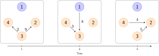

## Overview

This vignette describes how births, deaths and movements can be
incorporated into a model as scheduled events at predefined
time-points.  Events can, for example, be used to simulate disese
spread among multiple subpopulations (e.g., farms) when individuals
can move between the subpopulations and thus transfer infection, see
Figure 1.  In SimInf, we use `node` to denote a subpopulation.

$~$

```{r pressure, echo=FALSE, fig.align="left", fig.cap="**Figure 1.** Illustration of movements between nodes. Each time step depicts movements during one time unit, for example, a day. The network has *N=4* nodes where node *1* is infected and nodes *2*--*4* are non-infected. Arrows indicate movements of individuals from a source node to a destination node and labels denote the size of the shipment. Here, infection may spread from node *1* to node *3* at *t=2* and then from node *3* to node *2* at *t=3*.", out.width = '100%'}

```

## A first example

Let us define the **6** movement events in Figure 1 to include them in
an SIR model. Below is a `data.frame`, that contains the
movements. Interpret it as follows:

1. In time step **1** we move **9** individuals from node **3** to node **2**
2. In time step **1** we move **2** individuals from node **3** to node **4**
3. In time step **2** we move **8** individuals from node **1** to node **3**
4. In time step **2** we move **3** individuals from node **4** to node **3**
5. In time step **3** we move **5** individuals from node **3** to node **2**
6. In time step **3** we move **4** individuals from node **4** to node **2**

```{r, eval = TRUE, echo = TRUE, message = FALSE}
events <- data.frame(
    event      = rep("extTrans", 6),  ## Event "extTrans" is a movement between nodes
    time       = c(1, 1, 2, 2, 3, 3), ## The time that the event happens
    node       = c(3, 3, 1, 4, 3, 4), ## In which node does the event occur
    dest       = c(4, 2, 3, 3, 2, 2), ## Which node is the destination node
    n          = c(9, 2, 8, 3, 5, 4), ## How many individuals are moved
    proportion = c(0, 0, 0, 0, 0, 0), ## This is not used when n > 0
    select     = c(4, 4, 4, 4, 4, 4), ## Use the 4th column in the model select matrix
    shift      = c(0, 0, 0, 0, 0, 0)) ## Not used in this example
```

and have a look at the `data.frame`

```{r}
events
```

Now, create an SIR model where we turn off the disease dynamics
(beta=0, gamma=0) to focus on the scheduled events. Let us start with
different number of individuals in each node.

```{r}
library(SimInf)

model <- SIR(u0 = data.frame(S = c(10, 15, 20, 25),
                             I = c( 5,  0,  0,  0),
                             R = c( 0,  0,  0,  0)),
             tspan = 0:3,
             beta = 0,
             gamma = 0,
             events = events)
```

The compartments that an event operates on, is controlled by the
select value specified for each event together with the model select
matrix (E). Each row in E corresponds to one compartment in the model,
and the non-zero entries in a column indicate which compartments to
sample individuals from when processing an event. Which column to use
for an event is determined by the event select value. In this example,
we use the 4th column which means that all compartments can be sampled
in each movement event (see below).

```{r}
model@events@E
```

In another case you might be interested in only targeting the
susceptibles, which means for this model that we select the first
column. Now, let us run the model and generate data from it. For
reproducibility, we first call the `set.seed()` function since there
is random sampling involved when picking inviduals from the
compartments.

```{r}
set.seed(1)
result <- run(model)
```

And plot the number of individuals in each node.

```{r, fig.width=7, fig.height=4}
plot(result, range = FALSE)
```

```{r}
trajectory(result)
```
