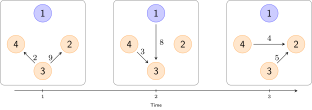

NB: This vignette is work-in-progress and not yet complete.

## Overview

This vignette describes how births, deaths and movements can be
incorporated into a model as scheduled events at predefined
time-points.  Events can, for example, be used to simulate disese
spread among multiple subpopulations (e.g., farms) when individuals
can move between the subpopulations and thus transfer infection, see
Figure 1.  In SimInf, we use `node` to denote a subpopulation.

SimInf supports four types of scheduled events:

- **Enter**: Add individuals to a node (e.g., births)
- **Exit**: Remove individuals from a node (e.g., deaths)
- **Internal transfer**: Move individuals between compartments within
    one node (e.g., vaccination, ageing)
- **External transfer**: Move individuals between nodes (e.g.,
    livestock movements)

$~$

```{r pressure, echo=FALSE, fig.align="left", fig.cap="**Figure 1.** Illustration of movements between nodes. Each time step depicts movements during one time unit, for example, a day. The network has *N=4* nodes where node *1* is infected and nodes *2*--*4* are non-infected. Arrows indicate movements of individuals from a source node to a destination node and labels denote the size of the shipment. Here, infection may spread from node *1* to node *3* at *t=2* and then from node *3* to node *2* at *t=3*.", out.width = '100%'}

```

## A first example: External transfer events

Let us define the **6** movement events in Figure 1 to include them in
an SIR model. Below is a `data.frame`, that contains the
movements. Interpret it as follows:

1. In time step **1** we move **9** individuals from node **3** to node **2**
2. In time step **1** we move **2** individuals from node **3** to node **4**
3. In time step **2** we move **8** individuals from node **1** to node **3**
4. In time step **2** we move **3** individuals from node **4** to node **3**
5. In time step **3** we move **5** individuals from node **3** to node **2**
6. In time step **3** we move **4** individuals from node **4** to node **2**

```{r, eval = TRUE, echo = TRUE, message = FALSE}
events <- data.frame(
  event      = rep("extTrans", 6),  ## Event "extTrans" is
                                    ##  a movement between nodes
  time       = c(1, 1, 2, 2, 3, 3), ## The time that the event happens
  node       = c(3, 3, 1, 4, 3, 4), ## In which node does the event occur
  dest       = c(4, 2, 3, 3, 2, 2), ## Which node is the destination node
  n          = c(9, 2, 8, 3, 5, 4), ## How many individuals are moved
  proportion = c(0, 0, 0, 0, 0, 0), ## This is not used when n > 0
  select     = c(4, 4, 4, 4, 4, 4), ## Use the 4th column in
                                    ## the model select matrix
  shift      = c(0, 0, 0, 0, 0, 0)) ## Not used in this example
```

and have a look at the `data.frame`

```{r}
events
```

Now, create an SIR model where we turn off the disease dynamics
(beta=0, gamma=0) to focus on the scheduled events. Let us start with
different number of individuals in each node.

```{r}
library(SimInf)

model <- SIR(u0 = data.frame(S = c(10, 15, 20, 25),
                             I = c(5,  0,  0,  0),
                             R = c(0,  0,  0,  0)),
             tspan = 0:3,
             beta = 0,
             gamma = 0,
             events = events)
```

The compartments that an event operates on, is controlled by the
select value specified for each event together with the model select
matrix (E). Each row in E corresponds to one compartment in the model,
and the non-zero entries in a column indicate which compartments to
sample individuals from when processing an event. Which column to use
in E for an event is determined by the event select value. In this
example, we use the 4<sup>th</sup> column which means that all
compartments can be sampled in each movement event (see below).

```{r}
select_matrix(model)
```

In another case you might be interested in only targeting the
susceptibles, which means for this model that we select the first
column. Now, let us run the model and generate data from it. For
reproducibility, we first call the `set.seed()` function and specify
the number of threads to use since there is random sampling involved
when picking inviduals from the compartments.

```{r}
set.seed(1)
set_num_threads(1)
result <- run(model)
```

And plot (Figure 2) the number of individuals in each node.

```{r, fig.width=7, fig.height=4, fig.align="left", fig.cap="**Figure 2.** Number of susceptible, infected and recovered individuals in each node."}
plot(result, range = FALSE)
```

$~$

Or use the `trajectory()` function to more easily inspect the outcome
in each node in detail.

```{r}
trajectory(result)
```

## Varying probability of picking individuals

It is possible to assign different probabillities for the compartments
that an event sample individuals from.  If the weights in the select
matrix $E$ are non-identical, individuals are sampled from a biased
urn.  To illustrate this, let us create movement events between two
nodes for the built-in SIR model, where we start with 300 individuals
($S = 100$, $I = 100$, $R = 100$) in the first node and then move
them, one by one, to the second node.

```{r}
u0 <- data.frame(S = c(100, 0),
                 I = c(100, 0),
                 R = c(100, 0))
```

```{r}
events <- data.frame(
  event = rep("extTrans", 300), ## Event "extTrans" is a movement between nodes
  time = 1:300,                 ## The time that the event happens
  node = 1,                     ## In which node does the event occur
  dest = 2,                     ## Which node is the destination node
  n = 1,                        ## How many individuals are moved
  proportion = 0,               ## This is not used when n > 0
  select = 4,                   ## Use the 4th column in the model select matrix
  shift = 0)                    ## Not used in this example
```

Now, create the model. Then run it, and plot the number of individuals
in the second node.

```{r}
model <- SIR(u0 = u0,
             tspan = 1:300,
             events = events,
             beta = 0,
             gamma = 0)
```

```{r, fig.width=7, fig.height=4, fig.align="left", fig.cap="**Figure 3.** The individuals have an equal probability of being selected regardless of compartment."}
plot(run(model), index = 2)
```

$~$

The probability to sample an individual from each compartment is

$$
p_S = \frac{w_S * S}{w_S * S + w_I * I + w_R * R}
$$

$$
p_I = \frac{w_I * I}{w_S * S + w_I * I + w_R * R}
$$

$$
p_R = \frac{w_R * R}{w_S * S + w_I * I + w_R * R}
$$

Where $w_S$, $w_I$ and $w_R$ are the weights in E.  These
probabilities are applied sequentially, that is the probability of
choosing the next item is proportional to the weights amongst the
remaining items.  Let us now double the weight to sample individuals
from the $I$ compartment and then run the model again.

```{r, fig.width=7, fig.height=4, fig.align="left", fig.cap="**Figure 4.** The individuals in the $I$ compartment are more likely of being selected for a movement event."}
model@events@E[2, 4] <- 2
plot(run(model), index = 2)
```

$~$

And a much larger weight to sample individuals from the $I$
compartment.

```{r, fig.width=7, fig.height=4, fig.align="left", fig.cap="**Figure 5.** The individuals in the $I$ compartment are even more likely of being selected for a movement event compared to the previous example."}
model@events@E[2, 4] <- 10
plot(run(model), index = 2)
```

$~$

Increase the weight for the $R$ compartment and run the model again.

```{r, fig.width=7, fig.height=4, fig.align="left", fig.cap="**Figure 6.** The individuals in the $I$ and $R$ compartments are more likely of being selected for a movement event compared to individuals in the $S$ compartment."}
model@events@E[3, 4] <- 4
plot(run(model), index = 2)
```

## Enter events: Adding individuals

Enter events are used to add individuals to a node. A common use case
is modelling births in a population. New individuals can be added to
specific compartments, and the E matrix weights determine which
compartments receive the new individuals when multiple compartments
are selected.

## Example: Births entering a population

Let us create a simple model where births occur at regular
intervals. Newborns enter the susceptible compartment.

```{r}
u0 <- data.frame(S = 20, I = 10, R = 0)
```

We schedule births at times 5, 10, and 15, adding 10 individuals each
time. All newborns enter the susceptible compartment (column 1 in the
E matrix).

```{r}
events <- data.frame(
  event      = rep("enter", 3), ## "enter" add new individuals to a node
  time       = c(5, 10, 15),    ## The time that the event happens
  node       = c(1, 1, 1),      ## In which node does the event occur
  dest       = c(0, 0, 0),      ## Not used for enter events
  n          = c(10, 10, 10),   ## How many individuals are added
  proportion = c(0, 0, 0),      ## Not used when n > 0
  select     = c(1, 1, 1),      ## Target the S compartment
  shift      = c(0, 0, 0))      ## Not used in this example
```

```{r}
model <- SIR(u0 = u0,
             tspan = 0:20,
             events = events,
             beta = 0,
             gamma = 0)
```

```{r, fig.width=7, fig.height=4, fig.align="left", fig.cap="**Figure 7.** The number of susceptible ($S$) individuals increases by 10 individuals at each scheduled event."}
plot(run(model))
```

## Weighted sampling for enter events

When the $E[, select]$ column contains multiple non-zero entries, the
new individuals are distributed among the compartments with
probability proportional to the weights. Let us demonstrate this by
creating a scenario where newborns can enter either $S$ or $R$
compartments. First, create the initial state and the scheduled
events. We will use `select=1` and show how we can adjust the select
matrix to include both the $S$ and $R$ compartments for that select
value.

```{r}
u0 <- data.frame(S = 20, I = 10, R = 0)
```

We schedule one birth event per day for 300 days, adding 1 individual
each time. We want each newborn to enter either the susceptible or the
recovered compartment, with probability proportional to the weights in
column 1 of the E matrix.

```{r}
events <- data.frame(
  event      = rep("enter", 300), ## "enter" add new individuals to a node
  time       = 1:300,             ## The time that the event happens
  node       = rep(1, 300),       ## In which node does the event occur
  dest       = rep(0, 300),       ## Not used for enter events
  n          = rep(1, 300),       ## How many individuals are added
  proportion = rep(0, 300),       ## Not used when n > 0
  select     = rep(1, 300),       ## Target the S and R compartments
                                  ## (after modifying E)
  shift      = rep(0, 300))       ## Not used in this example
```

```{r}
model <- SIR(u0 = u0,
             tspan = 0:300,
             events = events,
             beta = 0,
             gamma = 0)
```

Let us now change the select matrix so that we can use our events as
expected. It is not necessary to use `value=1` since that is the
default, however, for clarity we specifically set that value.

```{r}
select_matrix(model) <- data.frame(
  compartment = c("S", "R"),
  select      = c(1, 1),
  value       = c(1, 1))
```

Now, verify the select matrix.

```{r}
select_matrix(model)
```

```{r, fig.width=7, fig.height=4, fig.align="left", fig.cap="**Figure 8.** The number of susceptible ($S$) and recovered ($R) individuals increases over time."}
plot(run(model))
```

Let us modify the E matrix so that newborns are more likely to enter
the S compartment compared to the R compartment.

```{r}
select_matrix(model) <- data.frame(
  compartment = c("S", "R"),
  select      = c(1, 1),
  value       = c(2, 1))
```

```{r, fig.width=7, fig.height=4, fig.align="left", fig.cap="**Figure 9.** Individuals are more likely to enter as susceptible ($S$) compared to as recovered ($R$)"}
plot(run(model))
```

## Exit events: Removing individuals

Exit events remove individuals from a node. Common use cases include
natural mortality or culling. Like enter events, the E matrix weights
determine which compartments individuals are removed from when
multiple compartments are selected.

## Example: Mortality

Let us create a model where individuals die at scheduled times.

```{r}
u0 <- data.frame(S = 20, I = 10, R = 0)
```

```{r}
events <- data.frame(
  event      = rep("exit", 3),  ## "exit" remove individuals from a node
  time       = c(5, 10, 15),    ## The time that the event happens
  node       = c(1, 1, 1),      ## In which node does the event occur
  dest       = c(0, 0, 0),      ## Not used for exit events
  n          = c(5, 5, 5),      ## How many individuals are removed
  proportion = c(0, 0, 0),      ## Not used when n > 0
  select     = c(1, 1, 1),      ## Target the S compartment
  shift      = c(0, 0, 0))      ## Not used in this example
```

```{r}
model <- SIR(u0 = u0,
             tspan = 0:20,
             events = events,
             beta = 0,
             gamma = 0)
```

```{r, fig.width=7, fig.height=4, fig.align="left", fig.cap="**Figure 10.** The number of susceptible ($S$) individuals decreases by 5 individuals at each scheduled event."}
plot(run(model))
```

## Weighted sampling for exit events

We can also use weights to make certain compartments more likely to
lose individuals. For example, infected individuals might have higher
mortality risk.

```{r}
u0 <- data.frame(S = 100, I = 100, R = 0)
```

```{r}
events <- data.frame(
  event      = rep("exit", 100), ## "exit" remove individuals from a node
  time       = 1:100,            ## The time that the event happens
  node       = rep(1, 100),      ## In which node does the event occur
  dest       = rep(0, 100),      ## Not used for exit events
  n          = rep(1, 100),      ## How many individuals are removed
  proportion = rep(0, 100),      ## Not used when n > 0
  select     = rep(1, 100),      ## Target the S and I compartments
                                 ## (after modifying E)
  shift      = rep(0, 100))      ## Not used in this example
```

```{r}
model <- SIR(u0 = u0,
             tspan = 0:100,
             events = events,
             beta = 0,
             gamma = 0)
```

Let us increase the weight for the I compartment to make infected
individuals more likely to be removed:

```{r}
select_matrix(model) <- data.frame(
  compartment = c("S", "I"),
  select      = c(1, 1),
  value       = c(1, 5))
```

```{r, fig.width=7, fig.height=4, fig.align="left", fig.cap="**Figure 11.** The number of infected ($I$) individuals decreases faster compared to susceptibles ($S$)."}
plot(run(model))
```

## Internal transfer events: Moving within a node

Internal transfer events move individuals between compartments within
the same node. Common use cases include vaccination (moving from S to
R or V), ageing between age-structured compartments, or treatment
effects.

## Example: Vaccination of cattle herd

Let us create a model where a vaccination campaign moves susceptible
individuals to the recovered compartment at a specific time. We will
use `shift=1` and show how we can adjust the shift matrix to move
susceptible to recovered.

```{r}
u0 <- data.frame(S = 100, I = 10, R = 0)
```

At time 10, we vaccinate 30 susceptible individuals, moving them to
the R compartment.

```{r}
events <- data.frame(
  event      = "intTrans", ## "intTrans" move individuals within a node
  time       = 10,         ## The time that the event happens
  node       = 1,          ## In which node does the event occur
  dest       = 0,          ## Not used for intTrans events
  n          = 30,         ## How many individuals are vaccinated
  proportion = 0,          ## Not used when n > 0
  select     = 1,          ## Target the S compartment
  shift      = 1)          ## Use shift column 1 (after modifying N)
```

```{r}
model <- SIR(u0 = u0,
             tspan = 0:20,
             events = events,
             beta = 0,
             gamma = 0)
```

Let us now change the shift matrix so that we can use our events as
expected. Susceptible individuals will be moved to the recovered
compartment. With compartments ordered S=1, I=2, R=3, a value of 2
means individuals from compartment 1 (S) move to compartment 1+2=3
(R).

```{r}
shift_matrix(model) <- data.frame(compartment = "S", shift = 1, value = 2)
```

Now, verify the shift matrix.

```{r}
shift_matrix(model)
```

```{r, fig.width=7, fig.height=4, fig.align="left", fig.cap="**Figure 11.** The number of recovered ($R$) individuals increase at $t=10$."}
plot(run(model))
```
